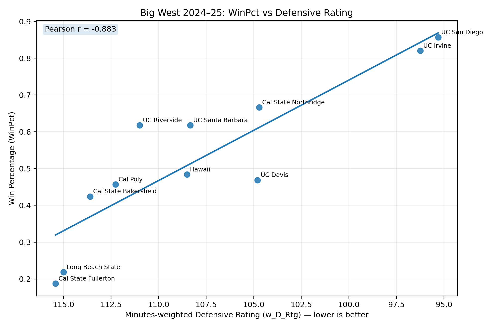
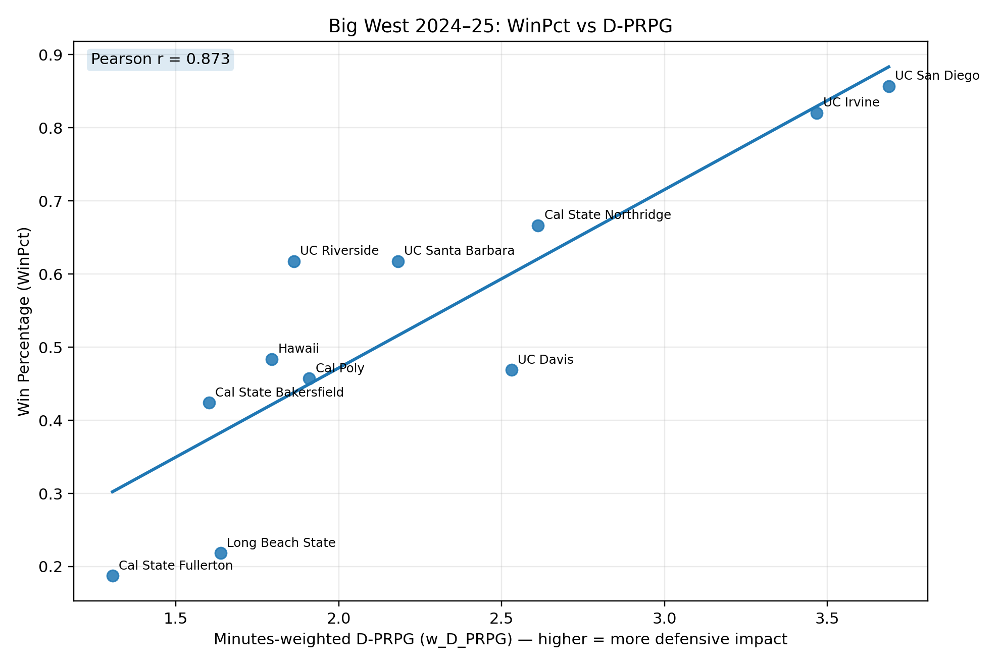
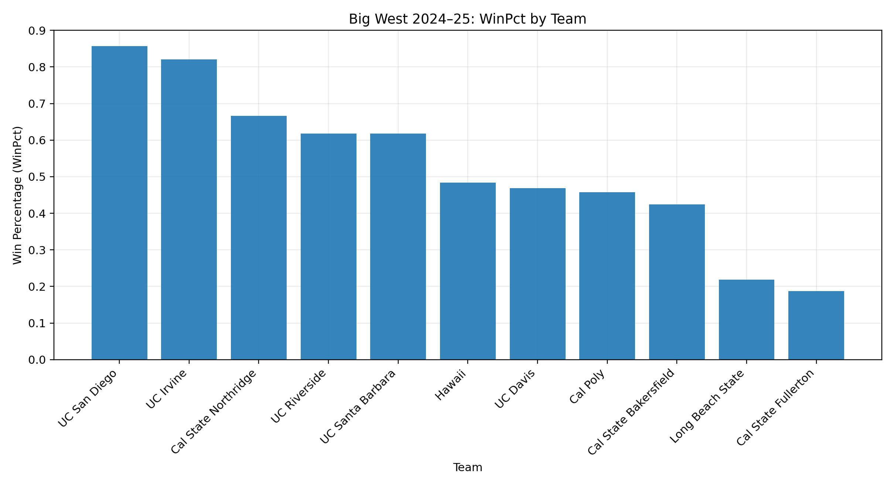
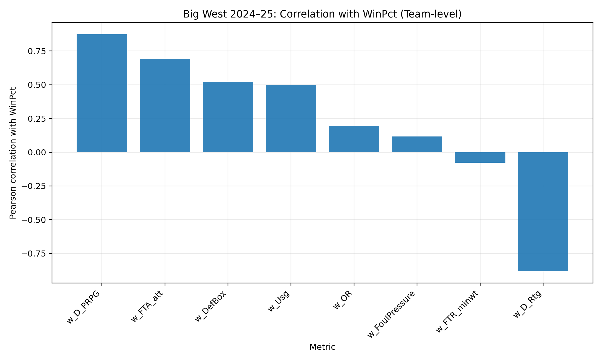
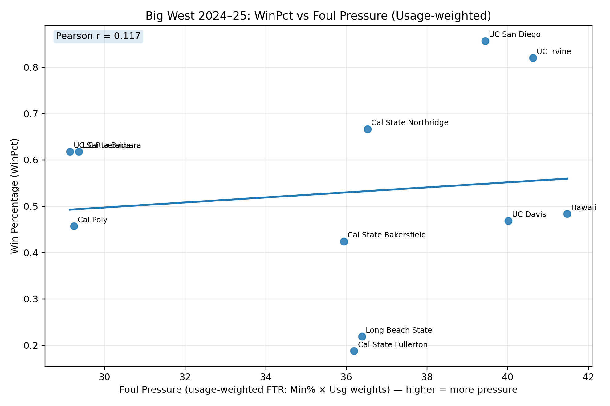

# Big West Men’s Basketball Analytics (2024–25)

This project analyzes **team-level winning in Big West men’s basketball** by aggregating
player-level metrics into minutes-weighted team indicators and evaluating their respective
relationship with 2024-2025's win percentage.

The analysis focuses on **defensive impact**, **foul pressure**, and how different forms of
player contribution scale from the individual level to team success. The reason for this is the belief that Big West basketball relies less on larger players and more on "hustle" and 2nd chance opportunities.

---

## Key Questions
- Which team-level defensive indicators correlate most strongly with winning?
- Does defensive impact measured at the player level scale meaningfully to team success?
- How does *foul pressure* (drawing fouls / getting to the line) relate to win percentage?

---

## Data Sources
- **Team records**: Sports-Reference (Big West conference page, 2024–25)
- **Player metrics**: Exported Big West player table including minutes %, defensive impact,
  usage, rebounding, blocks, steals, and fouls drawn

---

## Methodology
- Normalize team names across data sources
- Convert player metrics into **minutes-weighted team averages**
- Construct team-level indicators:
  - Defensive Rating (w_D_Rtg)
  - Defensive Points Reduced per Game (w_D_PRPG)
  - Defensive Box Score proxy (rebounds + blocks + steals)
  - Foul Pressure (minutes-weighted FTR and FTA)
  - Usage and offensive rebounding
- Evaluate relationships with:
  - Pearson correlations
  - Simple OLS regressions vs win percentage
- Generate publication-ready visualizations

---

## Results & Visualizations

### Defensive Rating vs Win Percentage
Lower defensive rating (better defense) is strongly associated with higher win percentage.



---

### Defensive Impact (D-PRPG) vs Win Percentage
Minutes-weighted defensive points prevented per game shows a strong positive relationship with winning.



---

### Win Percentage by Team
Distribution of conference win percentage across Big West teams.



---

### Correlation Summary
Comparison of team-level metrics by Pearson correlation with win percentage.



---

### Foul Pressure vs Win Percentage
Relationship between minutes-weighted foul pressure (FTR-based) and team win percentage.




---

## Key Findings
- **Defensive Rating** shows the strongest relationship with winning (Pearson r ≈ −0.88),
  reinforcing the importance of team-level defensive efficiency.
- **Defensive impact at the player level (D-PRPG)**, when minutes-weighted to the team,
  strongly correlates with win percentage (r ≈ 0.87), suggesting individual defensive value
  meaningfully scales to team success.
- **Foul pressure metrics** (FTR and FTA) exhibit weaker linear relationships with win
  percentage, indicating that drawing fouls may be more context-dependent rather than a
  direct driver of winning on its own.
  
---

## Outputs
- **Final dataset**:  
  `data/bigwest_2025_team_dataset.csv`

- **Figures** (auto-generated):  
  `data/figures/`
  - WinPct vs Defensive Rating  
  - WinPct vs D-PRPG  
  - WinPct by Team  
  - Correlation summary

---

## How to Run
```bash
python src/build_bigwest_dataset.py
python src/bigwest_figures.py

---
## Limitations & Extensions
- Analysis is limited to a single conference and season.
- Team-level correlations do not imply causation.
- Future work could extend this framework to all Division I conferences and explore distributional effects of defensive impact across rosters.

---
